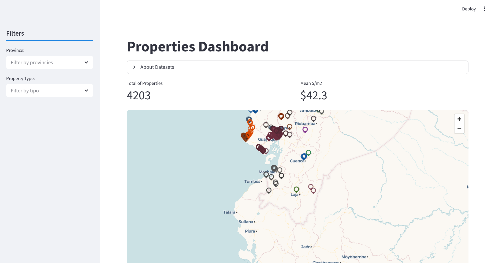
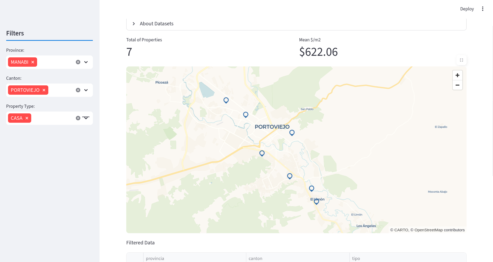
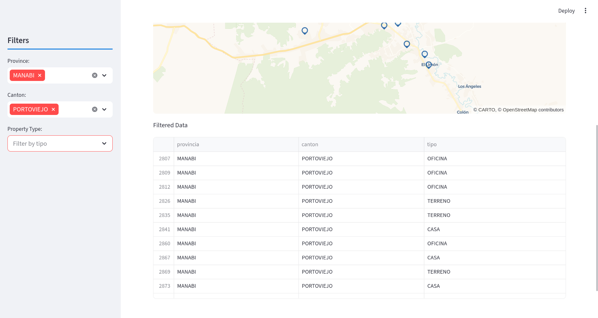

# 🏠 Dashboard Interactivo de Bienes Inmobiliarios en Ecuador

Este proyecto es un dashboard interactivo desarrollado para la exploración, análisis y visualización de información clave sobre bienes inmobiliarios en Ecuador. Integra datos catastrales oficiales con información de mercado inmobiliario para ofrecer una visión más completa del sector inmobiliario a nivel nacional.

---

## 📊 Objetivo del proyecto

El objetivo principal es centralizar, cruzar y visualizar información de bienes inmuebles en Ecuador, combinando:

- Datos catastrales oficiales (ubicación y registro de inmuebles)
- Datos de mercado (precio y metros cuadrados estimados)

Esto permite analizar tendencias de precios, distribución geográfica y características de los inmuebles en el país.

---

## 📁 Fuentes de datos

### 1. Datos Abiertos Ecuador
- 📌 Fuente: https://www.datosabiertos.gob.ec/dataset/base-de-datos-de-bienes-inmuebles-catastrados-ii-semestre-2025
- 🧾 Descripción: Base de datos oficial de bienes inmuebles catastrados en Ecuador durante el segundo semestre de 2025.
- 🎯 Uso en el proyecto:
  - Conteo total de inmuebles
  - Geolocalización de propiedades
  - Segmentación por provincia y cantón

### 2. Plusvalía.com
- 📌 Fuente: Portal inmobiliario Plusvalía
- 🧾 Descripción: Plataforma de compra y venta de bienes inmuebles.
- 🎯 Uso en el proyecto:
  - Extracción de precios por inmueble
  - Estimación de m² por tipo de propiedad
  - Cruce de información con datos catastrales

---

## 🧰 Tecnologías utilizadas

- 🐍 **Python** – Lenguaje principal del proyecto
- 🧮 **Polars** – Procesamiento eficiente de grandes volúmenes de datos
- 🦆 **DuckDB** – Persistencia y consultas analíticas de datos
- 🧼 **BeautifulSoup** – Web scraping de datos desde Plusvalía
- 📊 **Streamlit** – Desarrollo del dashboard interactivo
- 🐼 **Pandas** – Manipulación de datos dentro de Streamlit

---

## ⚙️ Funcionalidades del Dashboard

### 📌 KPIs principales
- Total de inmuebles registrados
- Precio promedio por metro cuadrado

### 🔎 Filtros interactivos
- Provincia
- Cantón
- Tipo de inmueble:
  - Casa
  - Departamento
  - Terreno
  - Local comercial
  - Oficina

### 🗺️ Visualizaciones
- Mapa interactivo con la ubicación geográfica de cada inmueble

### 📋 Tabla descriptiva
- Listado dinámico de inmuebles según los filtros seleccionados
- Información detallada por registro

---

## 🖼️ Capturas del Dashboard

### Vista general


### Mapa interactivo


### Tabla de datos


---

## 📂 Estructura del proyecto
```text
📦 ETL_CatastrosPlusvaliaEcuador
│
├── 📁 data/                     # Almacenamiento de datos crudos y procesados
│   │
│   ├── 📁 raw/                # Datos sin procesar (raw data)
│   │   │
│   │   ├── 📁 DA_CatastrosEcuador_2025
│   │   │   ├── diccionario.csv   # Diccionario de datos del catastro
│   │   │   ├── metadatos.csv     # Información descriptiva del dataset
│
├── 📁 pipelines/             # Flujos de procesamiento de datos (ETL orquestado)
│
├── 📁 src/                   # Código fuente principal del proyecto
│   │
│   ├── 📁 cleaning/          # Limpieza y estandarización de datos
│   ├── 📁 extraction/        # Extracción de datos desde fuentes externas
│   │   ├── 📁 plusvalia/
│   │   │   ├── beautifulsoup_plusvalia.py  # Scraping con BeautifulSoup
│   │   │   ├── request_plusvalia.py        # Requests para extracción web
│   │   │
│   │   ├── DA_gov_extraction.py            # Extracción de datos abiertos Ecuador
│   │
│   ├── 📁 transform/         # Transformación y enriquecimiento de datos
│   │   │
│   │   ├── 📁 implementations/  # Implementaciones concretas de transformación
│   │   ├── 📁 interfaces/        # Interfaces/contratos de transformación
│   │   │
│   │   ├── transform_gov.py      # Transformación de datos catastrales
│   │   ├── transform_plusvalia.py # Transformación de datos de mercado
│   │
│   ├── 📁 utils/             # Utilidades reutilizables
│   │
│   ├── app_dashboard.py      # Lógica del dashboard en Streamlit
│   ├── config.py             # Configuración global del proyecto
│   ├── main.py               # Punto de entrada principal del sistema
│
└── 📄 README.md
```
```
---

## 🚀 Cómo ejecutar el proyecto

```bash
# Clonar repositorio
git clone <repo-url>

# Entrar al proyecto
cd ETL_CatastrosPlusvaliaEcuador

# 1. Descarga la base de datos de catastros
# 2. Guarda el archivo .csv en una carpeta denominada data/raw/DA_CatastrosEcuador_2025/ (Recomendado). O en una carpeta diferente, sin embargo, no te olvides de cambiar la variable GOV_DIR en el archivo config.py

# Instalar dependencias
pip install -r requirements.txt

# Ejecutar el pipeline principal 
python3 -m main.py ó python -m main.py 

# Ejecutar dashboard
streamlit run app_dashboard.py
```

---
## 📌 Notas importantes
- Los datos del portal Plusvalía son utilizados únicamente con fines analíticos.
- La información puede contener variaciones respecto a valores reales del mercado.
- El sistema está optimizado para análisis exploratorio, no para valoración oficial de propiedades.

--- 
## 👨‍💻 Autor
Proyecto desarrollado como sistema de análisis de datos inmobiliarios en Ecuador utilizando fuentes abiertas y técnicas de scraping.
